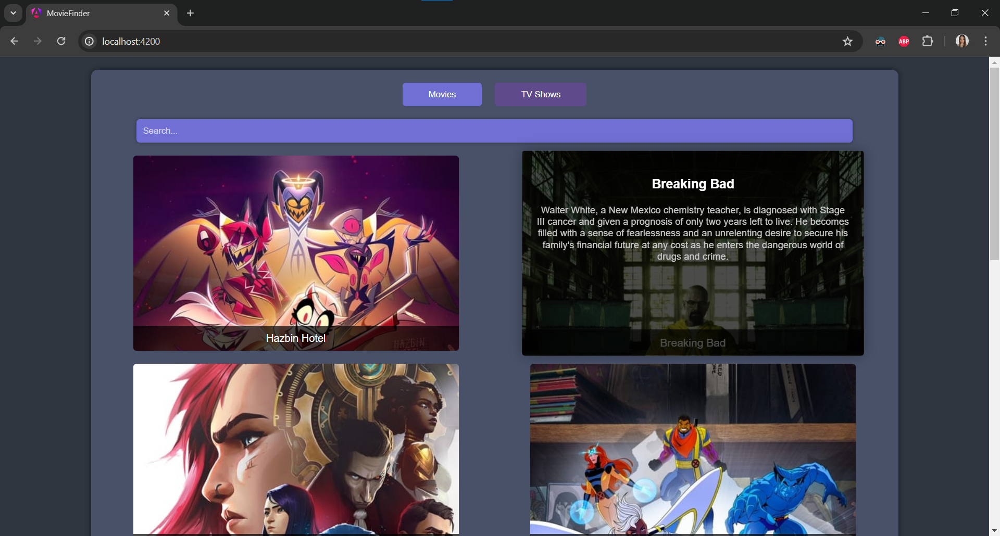
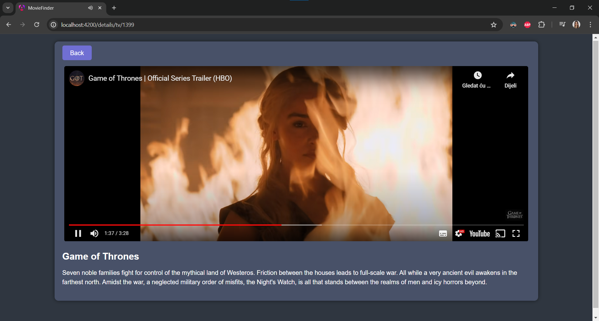

# MovieFinder
This project is a simple web application built using Angular that allows users to switch between movies and TV shows and view the top 10 listings from the Movie Database API. Users can also search for specific movies or shows and view detailed information about them.
## Features
- Home Page: Switch between movies and TV shows.
- Top 10 Listings: View the top 10 movies or TV shows from the Movie Database API.
- Search: Search for a specific movie or TV show by name.
- Details: View detailed information about a selected movie or TV show.
## Installation

1. **Clone the repository**:
   
   ```sh
   git clone https://github.com/NedzmijaMuminovic/MovieFinder
   ```

2. **Navigate to the project directory**:
   
   ```sh
   cd MovieFinder
   ```

3. **Install the dependencies**:
   
   ```sh
   npm install
   ```

## Running the App

To run the application locally, follow these steps:

1. **Start the development server**:
   
   ```sh
    ng serve
   ```

2. Open your browser and navigate to http://localhost:4200. The app should be running and accessible.

## Screenshots


